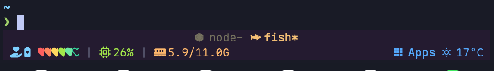

# tooie-tmux

Termux-first tmux statusbar widgets, packaged as a self-contained TPM plugin.



Designed to work best with the `shizuku-integration` branch of `termux-launcher`:

- `https://github.com/PickleHik3/termux-launcher`

**What It Does**
- Renders a two-line tmux statusbar (`status 2`):
  - Line 1: window list
  - Line 2: left/right widgets
- Sets `status-left`, `status-right`, `status-style`, `status-left-length`, `status-right-length`, and `status-justify`.
- Backs up your existing status options once (in `@tooie-tmux-backup-*` tmux options).

**Widgets**
- Left: battery, CPU, RAM
- Right: kew now-playing (only when playing), Apps menu, weather

Data sources:
- Preferred: `tooie resources` (Shizuku-backed snapshot provider)
- Fallbacks: `/proc` (CPU/RAM) and `termux-battery-status` (battery)
- Weather: `wttr.in`
- Music: `kew` via MPRIS (`https://github.com/ravachol/kew`)

## Install (TPM)

Add this before the TPM line in `~/.tmux.conf`:

```tmux
set -g @plugin 'PickleHik3/tooie-tmux'
```

Then in tmux: `prefix + I` (install) and `prefix + r` (reload, if you have a reload binding).

## Common Setup

Disable Shizuku-backed sourcing:

```tmux
set -g @tooie-tmux-enable-shizuku-data 'off'
```

Disable the Apps widget:

```tmux
set -g @tooie-tmux-widget-apps 'off'
```

## Options

All options are `set -g` and can be placed anywhere before TPM.

```tmux
# Master switches
set -g @tooie-tmux-enable 'on'
set -g @tooie-tmux-force-two-line 'on'

# Data source (use tooie resources when available)
set -g @tooie-tmux-enable-shizuku-data 'on'

# Widget toggles
set -g @tooie-tmux-widget-battery 'on'
set -g @tooie-tmux-widget-cpu 'on'
set -g @tooie-tmux-widget-ram 'on'
set -g @tooie-tmux-widget-kew 'on'
set -g @tooie-tmux-widget-apps 'on'
set -g @tooie-tmux-widget-weather 'on'

# Layout
set -g @tooie-tmux-status-left-length '600'
set -g @tooie-tmux-status-right-length '400'
set -g @tooie-tmux-status-justify 'centre'  # left|centre|right

# Base theme colors
set -g @tooie-tmux-color-prefix-bg '#f9f972'
set -g @tooie-tmux-color-prefix-fg '#241b30'
set -g @tooie-tmux-color-base-bg '#241b30'
set -g @tooie-tmux-color-base-fg '#55a8fb'
set -g @tooie-tmux-color-kew '#36f9f6'
set -g @tooie-tmux-color-window-inactive '#75715e'
set -g @tooie-tmux-color-window-active '#f4bf75'

# Widget colors/icons
set -g @tooie-tmux-color-separator '#6b7089'
set -g @tooie-tmux-color-ram '#ffb86c'
set -g @tooie-tmux-color-empty '#5f5f87'
set -g @tooie-tmux-color-meter-1 '#ff5f5f'
set -g @tooie-tmux-color-meter-2 '#ff875f'
set -g @tooie-tmux-color-meter-3 '#ffd75f'
set -g @tooie-tmux-color-meter-4 '#a4e84a'
set -g @tooie-tmux-color-meter-5 '#6ee7a2'
set -g @tooie-tmux-color-meter-6 '#34d399'
set -g @tooie-tmux-color-charging '#7dcfff'
set -g @tooie-tmux-icon-battery-full ''
set -g @tooie-tmux-icon-battery-empty ''
set -g @tooie-tmux-icon-battery-charging ' 󱈑'

# Apps widget
set -g @tooie-tmux-apps-label '󰀻 Apps'
set -g @tooie-tmux-apps-menu-file ''  # optional override path
```

## Apps Menu (Android + Terminal)

The Apps widget opens a tmux menu and supports:
- `android` entries: launch Android apps via `am start -n ...`
- `terminal` entries: open a new tmux window and run a command

Config file resolution order:

1. `@tooie-tmux-apps-menu-file` (if set)
2. `$HOME/.config/tooie-tmux/apps-menu.conf` (if present)
3. Plugin default: `scripts/apps-menu.conf`

File format:

```text
type|label|key|arg1|arg2
```

- `android`: `arg1` is `package/activity`
- `terminal`: `arg1` is the command, `arg2` is tmux window name (optional)

Example:

```text
android|Settings 󰒓|s|com.android.settings/com.android.settings.Settings|
terminal|btop |B|btop|btop
terminal|lazygit 󰊢|g|lazygit|git
```

## Dependencies

- Required: `tmux`, `jq`
- Optional:
  - `tooie` (for Shizuku-backed snapshots)
  - Termux:API + `termux-battery-status` (battery fallback)
  - `kew` + dbus (now-playing)

## Notes

- Apps launcher binds `MouseDown1StatusRight` and `M-Enter`.
- The default `scripts/apps-menu.conf` contains Termux/Android-specific app component names; most users should provide their own menu file.
